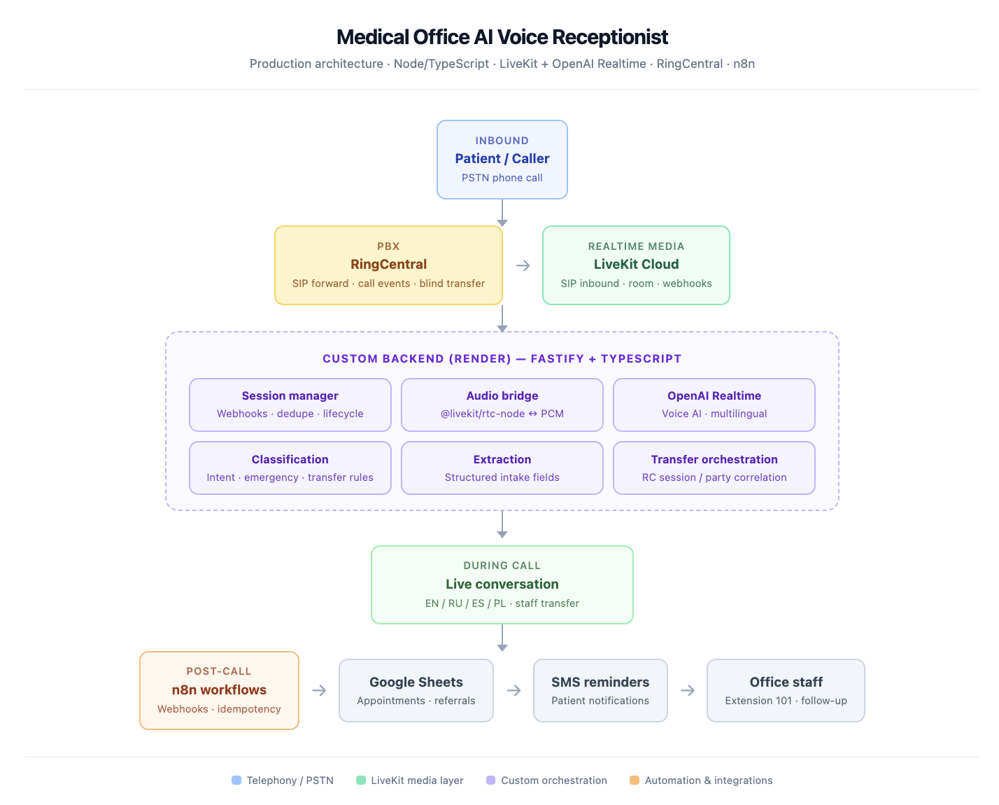
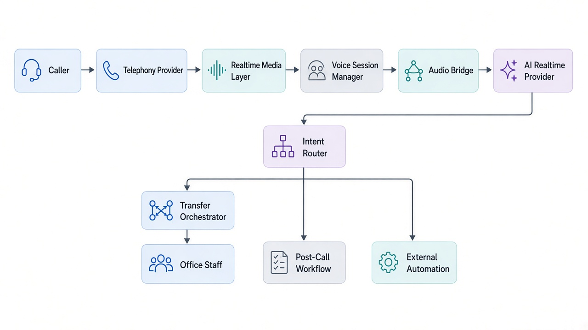
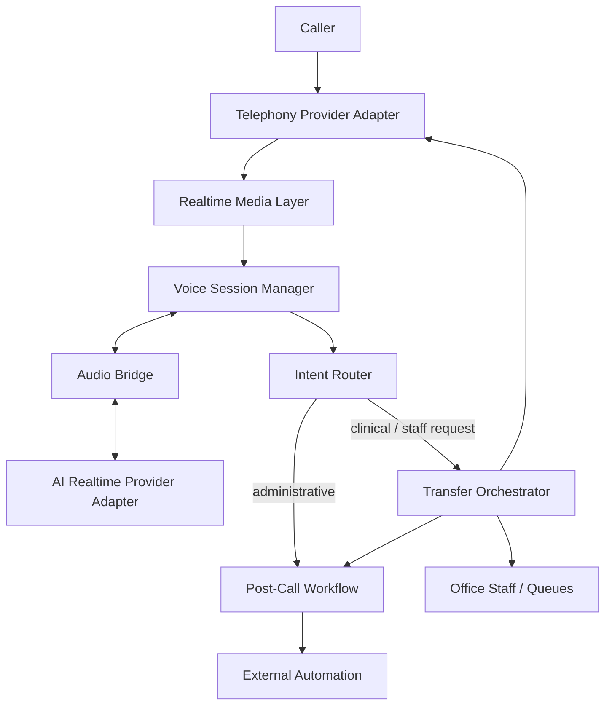
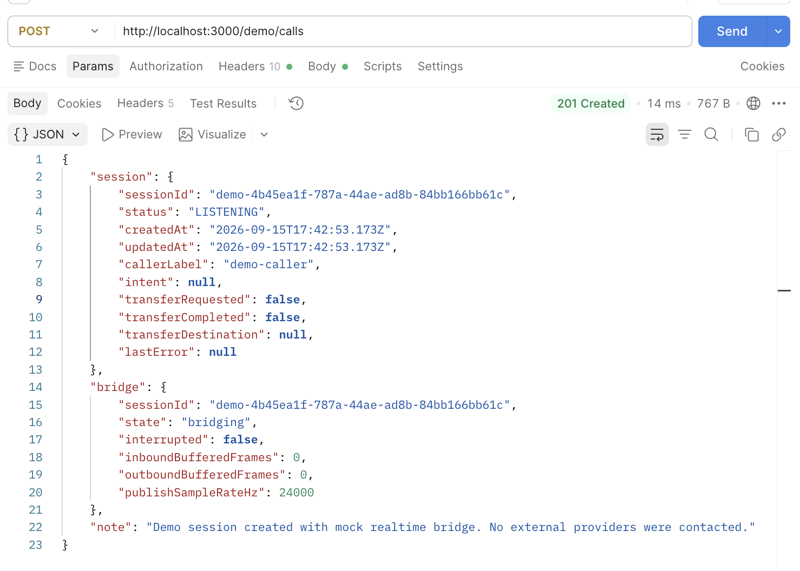
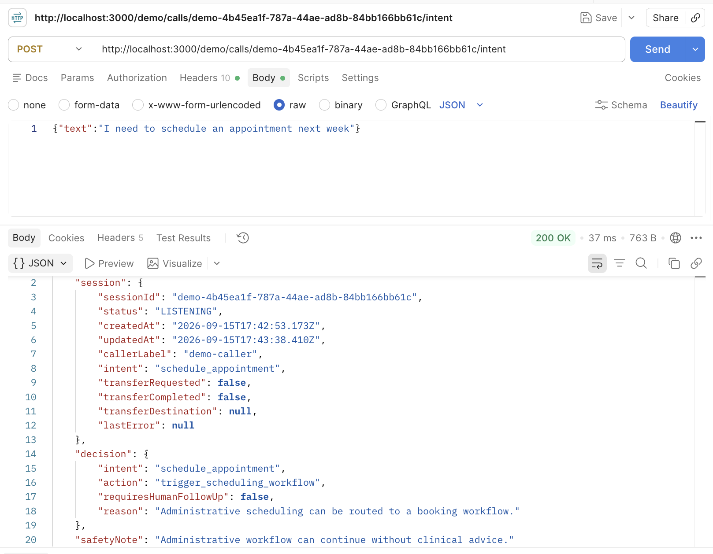
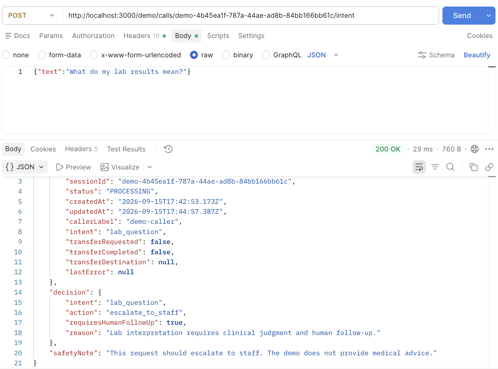
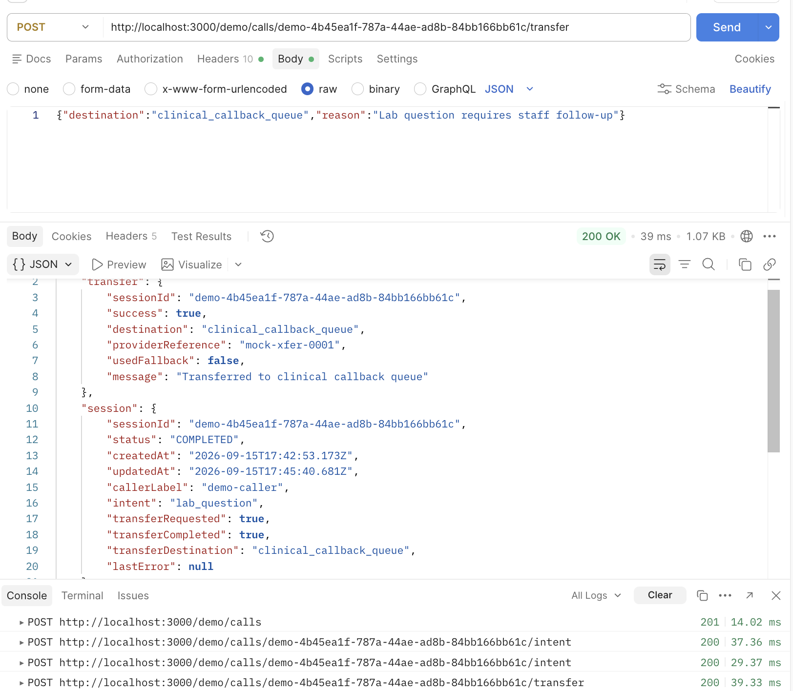

# Medical Office AI Voice Receptionist

A public engineering showcase based on a production AI voice receptionist I built for a medical office.

The production system automates front-desk phone workflows using TypeScript, Fastify, LiveKit, OpenAI Realtime, RingCentral, and n8n, with realtime voice handling, intent routing, staff transfers, and post-call automation.

This repository is a sanitized, clean-room implementation I created to demonstrate selected engineering patterns from that work. It contains no client source code, patient data, credentials, proprietary prompts, or private configuration.

The demo runs entirely with mock providers, so it can be reviewed and executed locally without access to production infrastructure.

It is designed as a **portfolio and interview artifact**: small enough to review quickly, but concrete enough to show how realtime voice systems are orchestrated beyond a model API call.

---

## Problem

Medical front desks handle a high volume of repetitive phone workflows — scheduling, rescheduling, office-hours questions, and requests to speak with staff — while also receiving questions that require human judgment.

An AI receptionist can automate administrative call handling, but it must escalate safely when a request involves clinical interpretation, prescriptions, or any decision that should not be answered by an automated system.

This demo focuses on that orchestration boundary: session lifecycle, intent routing, transfer handoff, and post-call automation.

---

## Production System Architecture

The diagram below is a high-level, sanitized view of the production system I built and integrated. It shows technology and orchestration boundaries only — not client credentials, PHI, private configuration, or proprietary source code.



In production, the call path spans RingCentral, LiveKit Cloud, a Node.js / TypeScript / Fastify backend, OpenAI Realtime, transfer orchestration, n8n workflows, and downstream administrative automation.

---

## What I Built

For the production medical-office system, I built and integrated components across the realtime voice and backend orchestration path — from incoming call handling to AI audio, intent routing, staff transfers, and downstream automation.

My work included:

- building the Node.js / TypeScript backend that coordinates voice sessions
- bridging realtime media between LiveKit and OpenAI Realtime
- managing call and session lifecycle state
- implementing intent classification and workflow routing
- orchestrating live call transfers back to office staff
- handling interruption, timing, and audio reliability issues
- connecting post-call workflows and administrative automation
- designing human escalation boundaries for requests that should not be handled automatically

For this public repository, I rebuilt selected patterns from scratch using mock provider interfaces. The goal is to demonstrate the architecture and engineering decisions without publishing the private production implementation.

---

## Public Demo Architecture

The runnable project below recreates selected orchestration patterns with mock adapters. It does not connect to RingCentral, LiveKit, OpenAI, n8n, or any production infrastructure.



Conceptual flow:

```text
Caller
  → Telephony Provider
  → Realtime Media Layer
  → Voice Session Manager
  ↔ Audio Bridge ↔ AI Realtime Provider
  → Intent Router
  → Transfer / Workflow Orchestration
  → Office Staff / External Automation
```



See [`docs/architecture.md`](docs/architecture.md) for the Mermaid source.

---

## Demo in Action

The demo runs locally and simulates the orchestration path without contacting external providers. The screenshots below highlight the difference between an **automation path** and a **human escalation path**.

### 1. Start a voice session



A synthetic call session is created, the session enters `LISTENING`, and the mock realtime bridge is initialized. No external providers are contacted.

### 2. Route an administrative request



A scheduling request is classified as `schedule_appointment` and routed to `trigger_scheduling_workflow` without requiring human follow-up.

### 3. Escalate a clinical request



A lab interpretation request is classified as `lab_question` and explicitly escalated (`requiresHumanFollowUp: true`) because it requires clinical judgment. The demo does not provide medical advice.

### 4. Transfer to staff



The transfer orchestrator records a successful handoff to a synthetic clinical callback queue through the mock telephony provider. This is a simulated transfer outcome — not a live phone call.

---

## Try the Demo

### Prerequisites

- Node.js 20+

### Run locally

```bash
npm install
npm run dev
```

The server listens on `http://localhost:3000` by default.

All providers run in **mock mode**. You do not need LiveKit, OpenAI, RingCentral, or n8n credentials.

Replace `SESSION_ID` in the examples below with the `session.sessionId` returned by `POST /demo/calls`.

### 1) Create a demo call

```bash
curl -s -X POST http://localhost:3000/demo/calls \
  -H 'Content-Type: application/json' \
  -d '{"callerLabel":"demo-caller"}' | jq
```

### 2) Route an administrative intent

```bash
curl -s -X POST http://localhost:3000/demo/calls/SESSION_ID/intent \
  -H 'Content-Type: application/json' \
  -d '{"text":"I need to schedule an appointment next week"}' | jq
```

### 3) Escalate and transfer to staff

```bash
curl -s -X POST http://localhost:3000/demo/calls/SESSION_ID/intent \
  -H 'Content-Type: application/json' \
  -d '{"text":"What do my lab results mean?"}' | jq

curl -s -X POST http://localhost:3000/demo/calls/SESSION_ID/transfer \
  -H 'Content-Type: application/json' \
  -d '{"destination":"clinical_callback_queue","reason":"Lab question requires staff follow-up"}' | jq
```

### 4) Complete a session and publish a post-call event

```bash
curl -s -X POST http://localhost:3000/demo/calls/SESSION_ID/complete | jq
```

### Health check

```bash
curl -s http://localhost:3000/health | jq
```

### Example Call Flow

**Administrative scheduling**

1. Incoming call
2. Session initialized
3. Caller asks to schedule an appointment
4. Intent classified as `schedule_appointment`
5. Administrative workflow selected
6. Structured workflow event created
7. Call completed

**Clinical escalation**

1. Incoming call
2. Caller asks a question requiring clinical judgment
3. Intent requires human escalation
4. Transfer orchestrator selects a staff destination
5. Telephony adapter performs a demo transfer
6. Transfer outcome recorded
7. Post-call event published

More detail: [`examples/call-flow.json`](examples/call-flow.json)

---

## Production Challenges

### Realtime audio reliability

Realtime voice systems coordinate media streams that rarely share the same clock, packet timing, or sample rate. In production I had to account for buffering, sample-rate conversion boundaries, late media track attachment after a room was already live, and deterministic cleanup so sockets and tracks did not leak after a caller hung up.

### Barge-in and false interruptions

One of the issues I had to solve in production was distinguishing real caller interruptions from background audio and false voice-activity detection.

I worked with greeting protection, VAD behavior, debounce/cooldown logic, and interruption handling so that background noise would not repeatedly cut off the assistant while still allowing a caller to interrupt naturally.

### Reliable call transfers

A particularly challenging integration was transferring an active AI call back to office staff.

I had to correlate the active telephony session with the correct call party, maintain transfer state, prevent duplicate actions, and provide fallback behavior when the normal transfer path could not complete.

In this public demo, I recreated the transfer orchestration pattern with a mock telephony provider, without exposing the production RingCentral integration.

### AI safety boundaries

Administrative intents (scheduling, cancellations, office hours) can be automated. Requests that require medical judgment — for example prescription or lab questions — should escalate to qualified staff. This demo encodes that boundary in the intent router rather than pretending the model can safely answer clinical questions.

### Failure recovery

Broken voice sessions are worse than no automation. I designed the voice flow around explicit terminal states (`COMPLETED` / `FAILED`), fallback behavior, idempotent transfer handling, and structured post-call events so downstream workflows could reliably determine what happened.

---

## AI-Native Development

I use AI-assisted engineering tools as part of my development workflow for:

- rapid prototyping of architecture options
- generating first-pass tests around state machines and routing rules
- debugging edge cases in session and transfer flows
- drafting documentation that matches the actual implementation
- reviewing failure modes before wiring external providers

I remain responsible for architecture decisions, validation, testing, integration boundaries, security review, and production behavior. AI assistance speeds exploration; it does not replace engineering judgment.

---

## Tests

```bash
npm test
npm run typecheck
```

The suite covers:

- intent routing
- human escalation
- successful transfer
- duplicate transfer protection
- fallback behavior

---

## Privacy & Clean-Room Boundary

- No PHI is included
- No real patient records are used
- No real credentials are included
- Example payloads are synthetic
- Production healthcare deployments require appropriate security controls, access management, auditing, encryption, and compliance review

The production architecture diagram describes the system at a high level. The source code in this repository is a separate clean-room implementation created specifically for public demonstration.

This demo is **not** a HIPAA compliance claim. It is an engineering architecture showcase.

---

## Repository Design Philosophy

I intentionally kept this repository focused on **orchestration boundaries and reliability patterns**:

- provider interfaces instead of hard-coded vendor SDKs
- mock adapters so the demo runs offline
- small modules a hiring manager can read in one sitting
- tests that protect the important behavior (routing, escalation, transfer idempotency, fallback)

The goal is to show how I think about production AI systems — not to reproduce a private client codebase.

---

### Repository Structure

```text
medical-office-ai-voice-receptionist-demo/
├── README.md
├── LICENSE
├── .gitignore
├── .env.example
├── package.json
├── tsconfig.json
├── vitest.config.ts
├── docs/
│   ├── architecture.md
│   ├── architecture.png
│   ├── production-architecture.png
│   ├── demo-session.png
│   ├── demo-scheduling.png
│   ├── demo-escalation.png
│   └── demo-transfer.png
├── src/
│   ├── index.ts
│   ├── config.ts
│   ├── types.ts
│   ├── session-manager.ts
│   ├── audio-bridge.ts
│   ├── intent-router.ts
│   ├── transfer-orchestrator.ts
│   ├── post-call-workflow.ts
│   └── adapters/
│       ├── realtime-provider.ts
│       ├── telephony-provider.ts
│       └── workflow-provider.ts
├── examples/
│   └── call-flow.json
└── tests/
    ├── intent-router.test.ts
    └── transfer-orchestrator.test.ts
```

---

## Stack

| Layer | Demo choice |
|-------|-------------|
| Language | TypeScript (strict) |
| HTTP | Fastify |
| Validation | Zod |
| Tests | Vitest |
| Media / AI / Telephony / Workflows | Interface + mock adapters |

---

## License

MIT
