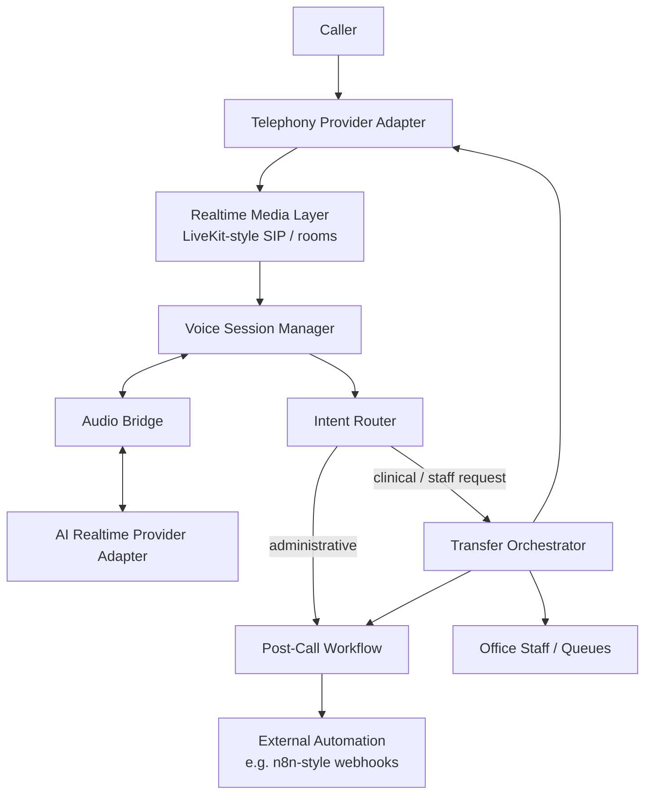

# Architecture

This document is the source of truth for the portfolio architecture diagram.

## Mermaid

## Exporting / refreshing `architecture.png`

A committed diagram is available at `docs/architecture.png`.

To regenerate it:

1. Open [mermaid.live](https://mermaid.live)
2. Paste the Mermaid block above
3. Export as PNG
4. Save as `docs/architecture.png`

No heavy diagram tooling is required to run this repository.
